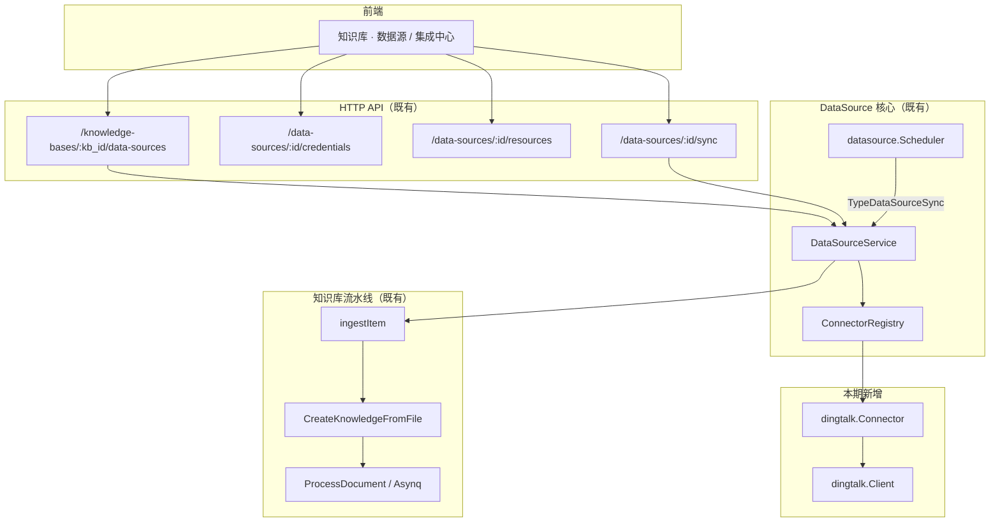
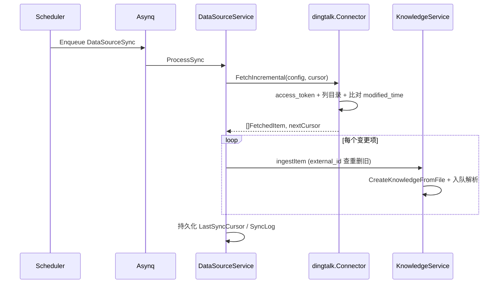

# 钉钉在线文档 → 知识库同步（首期）架构设计

| 项 | 说明 |
|----|------|
| 状态 | 设计稿（开发前评审） |
| 范围 | **仅钉钉文档中心「在线文档（Doc）」**；不含知识库 Wiki、多维表、脑图等 |
| 性质 | **纯增量能力**：不修改既有知识库解析、RAG、Agent、IM 等核心路径的行为契约 |
| 关联常量 | `types.ConnectorTypeDingTalk`（`"dingtalk"`）已预留，本期实现 Connector 并注册 |

---

## 1. 目标与非目标

### 1.1 目标

- 在指定**文档型知识库**上配置钉钉数据源，选择同步目录/文档范围。
- 支持 **Cron 定时同步**与**手动立即同步**（复用现有 DataSource 调度与 Asynq 任务）。
- **增量更新**：依据钉钉侧文档修改时间（及连接器游标）仅拉取变更项。
- 变更项写入知识库后走**既有文档解析流水线**（DocReader → 分块 → 向量索引 → 可选 enrichment），语义上等价于「删除旧 knowledge 记录后重新上传并解析」（见 §5.3）。

### 1.2 非目标（首期不做）

| 非目标 | 说明 |
|--------|------|
| 钉钉知识库 / Wiki 树 | 与飞书 Wiki Connector 不同 API，另立项 |
| 多维表、脑图、日程等 | 仅 `Resource.Type` 过滤为在线 Doc |
| 源端删除自动删 KB 文档 | 与全平台 DataSource 一致：检测删除仅计数，不调用 `DeleteKnowledge`（防误删） |
| 改造 `ingestItem` 为 Reparse 原地更新 | 保持平台统一「external_id → 删旧建新」策略 |
| 与钉钉 **IM 机器人**配置合并 | IM 走 `internal/infrastructure/channels/dingtalk`；数据源凭证独立加密存储 |

---

## 2. 设计原则：增量与解耦

### 2.1 插件式 Connector（与飞书 / Notion / 语雀 / RSS 同级）

```
┌─────────────────────────────────────────────────────────────┐
│ 既有稳定面（本期不改动行为，仅允许「注册一行」类装配）          │
├─────────────────────────────────────────────────────────────┤
│ types.DataSource / SyncLog / FetchedItem                    │
│ internal/datasource.Connector 接口                          │
│ DataSourceService.ProcessSync / ingestItem                  │
│ KnowledgeService.CreateKnowledgeFromFile|URL + ProcessDocument│
│ Scheduler + TypeDataSourceSync Asynq                        │
│ Handler: datasource.go / datasource_credentials.go          │
│ RBAC: 知识库所属租户 + DataSource 凭证子资源                   │
└─────────────────────────────────────────────────────────────┘
                              ▲
                              │ 仅通过 ConnectorRegistry.Register
                              │
┌─────────────────────────────────────────────────────────────┐
│ 本期新增（独立包，可单独评审 / 回滚）                          │
├─────────────────────────────────────────────────────────────┤
│ internal/datasource/connector/dingtalk/*                      │
│ 前端：connector 元数据 + 钉钉凭证表单 + 资源选择（若尚未通用化）│
│ 单测 + httptest mock Client                                   │
└─────────────────────────────────────────────────────────────┘
```

### 2.2 允许的最小「装配」改动（非业务逻辑变更）

| 位置 | 改动 | 性质 |
|------|------|------|
| `internal/container/container.go` → `initConnectorRegistry` | `registry.Register(dingtalk.NewConnector())` | 与 feishu/notion 同级的一行注册 |
| `frontend` connector 类型列表 / i18n | 增加 `dingtalk` 展示与表单字段 | 配置面扩展 |
| 文档 | 本文档 + 可选 `接入与扩展指南.md` 中增加一节链接 | 无运行时影响 |

**禁止（除非单独 RFC）**：修改 `ingestItem`、`ProcessDocument`、`ReparseKnowledge` 核心分支；修改 `Knowledge` 表结构；在 IM dingtalk 包内混入文档 Open API。

### 2.3 与项目红线 / 边界对齐

| 约束域 | 本功能遵守方式 |
|--------|----------------|
| **多租户** | DataSource 绑定 `tenant_id` + `knowledge_base_id`；Handler 沿用 `getOwnedKnowledgeBase` / `ownDataSource` |
| **凭证安全** | 凭证仅经 `DataSourceConfig.ToJSON()` 写入 `data_sources.config`；`SYSTEM_AES_KEY` 下字符串字段 AES-256-GCM；API 响应经 `dto` 剥离 secrets |
| **SSRF** | Connector **不得**将需鉴权的钉钉下载 URL 交给 `CreateKnowledgeFromURL` 拉取；应在 Connector 或 ingest 前用 **带 token 的服务端 HTTP** 取字节 → `CreateKnowledgeFromFile` |
| **存储配额** | 复用 `CreateKnowledgeFromFile` / URL 路径内既有 `StorageQuota` 检查 |
| **RBAC** | 创建/同步数据源需对 KB 具备写权限（与现有 DataSource API 一致） |
| **可观测** | SyncLog + `logger` 字段；可选 `langfuse.InjectTracing` 注入同步任务 payload（与现网 sync 一致） |
| **幂等 / 多实例** | Scheduler：`HasRunningSync` + Asynq 确定性 `TaskID`；`external_id` 去重更新 |

---

## 3. 逻辑架构



### 3.1 同步时序（增量）



---

## 4. 钉钉 Connector 设计（`internal/datasource/connector/dingtalk`）

### 4.1 包内职责划分（建议）

| 文件 | 职责 |
|------|------|
| `connector.go` | 实现 `datasource.Connector` 全部方法 |
| `client.go` | access_token、目录列表、文档元数据、导出/下载 |
| `config.go` | 从 `types.DataSourceConfig` 解析 `app_key` / `app_secret` / `corp_id` 等 |
| `cursor.go` | `connector_cursor` JSON 结构（文档 ID → 修改时间 / revision） |
| `types.go` | 钉钉 API DTO（与 Open API 对齐，不泄漏到 `types` 包） |
| `connector_test.go` / `client_test.go` | 游标增量、资源 ID、错误项 metadata |

参考实现（**只读对照，不修改**）：`internal/datasource/connector/feishu/`（懒加载 `ListResources`、`FetchIncremental` + `SpaceNodeTimes` 模式）。

### 4.2 `Connector` 接口映射（在线 Doc）

| 方法 | 首期行为 |
|------|----------|
| `Type()` | `"dingtalk"`（`types.ConnectorTypeDingTalk`） |
| `Validate` | 获取 token + 调用只读探测 API（如根目录或当前应用可见范围） |
| `ListResources` | `parentID==""` → 文档空间/根文件夹；非空 → 子节点；`Resource.Type` 区分 `folder` / `doc`；`HasChildren` 供懒加载 |
| `ResolveResourceAncestors` | 已选深层 `doc`/`folder` 时返回祖先链 ExternalID（与飞书 Wiki 选择器 UX 一致） |
| `FetchAll` | 对 `config.ResourceIDs` 递归枚举在线 Doc，拉取内容与元数据 |
| `FetchIncremental` | 读 `SyncCursor.ConnectorCursor`；枚举范围内 Doc；`modified_time`（或 API 等价字段）未变则 skip；变更则导出内容；可选检测删除 → `FetchedItem.IsDeleted` |

### 4.3 `FetchedItem` 约定

| 字段 | 约定 |
|------|------|
| `ExternalID` | 钉钉文档稳定 ID（全局唯一于连接器内） |
| `Title` / `FileName` | 展示名；`FileName` 带扩展名（`.md` / `.docx` / `.pdf` 等，与导出格式一致） |
| `Content` | 优先：导出 Markdown 或纯文本；否则导出 docx/pdf 二进制 |
| `ContentType` | 与 Content 一致 |
| `URL` | 钉钉控制台链接（审计/跳转）；**不作为** ingest 主路径 |
| `UpdatedAt` | 钉钉侧最后修改时间 |
| `Metadata` | 可含 `dingtalk_doc_type=doc`、`union_id` 等；失败项 `error` 键（平台已支持统计 `ItemsFailed`） |
| `SourceResourceID` | 所属文件夹或同步根 `ResourceIDs` 项 |
| `IsDeleted` | 源端删除时置位（KB 侧仍不自动删，见 §1.2） |

### 4.4 配置模型（`DataSourceConfig`）

存储于 `data_sources.config`（加密 credentials + 明文 settings/resource_ids）：

```json
{
  "type": "dingtalk",
  "credentials": {
    "app_key": "<encrypted>",
    "app_secret": "<encrypted>",
    "corp_id": "<encrypted>"
  },
  "resource_ids": ["<folder_or_doc_external_id>"],
  "settings": {
    "export_format": "markdown",
    "include_subfolders": true
  }
}
```

- 凭证更新走 **`PUT /data-sources/:id/credentials/credentials`**（整包替换），与现网一致。
- **不与** IM Channel 的 `client_id` / `client_secret` 共用存储；若客户使用同一钉钉应用，仅在控制台配置两次相同值。

### 4.5 增量游标（`last_sync_cursor`）

建议结构（存入 `SyncCursor.ConnectorCursor`）：

```json
{
  "last_sync_time": "2026-07-06T12:00:00Z",
  "doc_revisions": {
    "<external_id>": "<modified_time_or_revision>"
  },
  "scoped_resource_ids": ["..."]
}
```

- 首次同步：`cursor == nil` → 视同为全量枚举 + 全量拉取（仍可用 `sync_mode=incremental`，由「无历史 revision」触发全拉）。
- 拉取失败时：**仍持久化 cursor**（与 `ProcessSync` 对 RSS/Feishu 行为一致），避免恢复后重复全量。

### 4.6 错误与部分成功

- 单文档导出失败：返回带 `Metadata["error"]` 的 `FetchedItem`，不中断整次 sync。
- 目录枚举部分失败：可包装为 `datasource.PartialFetchError`（若钉钉 Client 支持分段错误），由 `ProcessSync` 记 `SyncLogStatusPartial`。
- Token 失效 / 权限不足：整次 `Fetch*` 失败 → `DataSourceStatusError` + SyncLog `failed`。

---

## 5. 与知识库流水线的边界

### 5.1 `ingestItem`（不修改实现）

现有逻辑（摘要）：

1. `channel = ds.Type` → knowledge `channel` 为 `dingtalk`（`types.ChannelDingtalk` 已存在）。
2. `metadata`: `external_id`, `datasource_id`, `source_resource_id` + 条目 metadata。
3. 已存在 `external_id` → `DeleteKnowledge` → `CreateKnowledgeFromFile` 或 `CreateKnowledgeFromURL`。
4. 自动标签：按数据源名称 `FindOrCreateTagByName`。

钉钉首期应 **100% 走路径 3 的 File 分支**（Content 非空）。

### 5.2 解析与 enrichment

- 入队任务类型：`types.TypeDocumentProcess`（与上传文件相同）。
- 分块、向量库绑定、Wiki ingest（若 KB 开启 Wiki）均由**现有** `KnowledgePostProcess` 触发，钉钉无需感知。

### 5.3 「重新解析」语义

- 产品层「文档更新后重新入库」= 平台已实现的 **delete + create + ProcessDocument**。
- 不调用 `ReparseKnowledge` API，除非未来 RFC 统一 ingest 策略。

---

## 6. API 与前端（尽量复用）

### 6.1 后端 API

**无新 REST 资源**；使用既有路由（见 `internal/router/router.go` 与 `DataSourceHandler`）：

- CRUD `data-sources`
- `GET .../resources?parent_id=`
- `POST .../resources/resolve-ancestors`
- `POST .../sync`、`/pause`、`/resume`
- `GET .../logs`
- `GET /connectors`（注册后自动出现在 `connectorRegistry.List()`）

### 6.2 前端

| 项 | 说明 |
|----|------|
| 入口 | `KnowledgeBaseDataSource.vue` / `integrations/datasource/*`（与 feishu/notion/yuque 并列） |
| i18n | `zh-CN` / `en-US` / `ja-JP` / `ko-KR` 增加 `dataSources.types.dingtalk` 及表单标签 |
| 资源选择器 | 复用 `DataSourceResourceSelector.vue` 懒加载协议 |
| connector 元数据 | 若使用 `frontend/src/config/datasource-connectors.ts`，增加 `dingtalk` 字段 schema（`app_key`, `app_secret`, `corp_id`） |

---

## 7. 安全与合规

| 风险 | 缓解 |
|------|------|
| 凭证泄露 | AES 落库 + DTO 不回显 + 日志 `SanitizeForLog` |
| SSRF | 禁止未鉴权 URL ingest；下载仅指向钉钉 API 域名（Client 内 allowlist） |
| 越权访问文档 | 依赖钉钉应用「可见范围」；Validate 阶段文档化提示管理员授权 |
| 大文件 / 限流 | Client 超时、单 sync `MaxItems`（payload 已有）；超大文档记 failed 不拖死队列 |

---

## 8. 测试策略

| 层级 | 内容 |
|------|------|
| 单元测试 | `FetchIncremental` 跳过未变文档；revision 变化触发 fetch；`ListResources` parent 语义 |
| Client httptest | token 刷新、4xx/5xx、分页 |
| 集成（可选） | 标记 `integration` 的真实租户；CI 默认不跑 |
| 回归 | 确保未注册 dingtalk 时现有 feishu/notion 测试不受影响 |

---

## 9. 部署与运维

- **无新迁移**：`data_sources` / `sync_logs` 表已存在；`ConnectorTypeDingTalk` 已定义。
- **依赖**：出站 HTTPS 访问钉钉 Open API；与 DocReader 服务无新增耦合。
- **配置**：`SYSTEM_AES_KEY` 生产必配；Cron 表达式带秒（Scheduler 使用 `cron.WithSeconds()`）。
- **监控**：查看 `sync_logs` 的 `items_updated` / `items_failed` 及数据源 `error_message`。

---

## 10. 实施清单（开发顺序）

1. **钉钉开放平台**：企业内部应用 + 在线文档只读/导出权限确认（以官方文档为准）。
2. **`dingtalk` Client**：token + 目录 + 导出。
3. **`dingtalk.Connector`**：实现接口 + 游标 + 单测。
4. **`initConnectorRegistry` 注册**（唯一 Go 装配点）。
5. **前端** connector 配置与 i18n。
6. **联调**：手动 sync → 知识库列表 `channel=dingtalk` → 解析完成 → 增量二次 sync 仅 updated 计数增加。

---

## 11. 回滚策略

- 移除 `registry.Register(dingtalk...)` → 已存 `type=dingtalk` 的数据源在 sync 时报 `connector not found`（与删除 connector 代码行为一致）；**不删除**已同步 knowledge。
- 删除 `internal/datasource/connector/dingtalk` 包即可下线代码路径。

---

## 12. 参考代码索引（只读）

| 主题 | 路径 |
|------|------|
| Connector 接口 | `internal/datasource/connector.go` |
| 同步主流程 | `internal/application/service/datasource_service.go` → `ProcessSync`, `ingestItem` |
| 调度 | `internal/datasource/scheduler.go` |
| 类型与常量 | `internal/types/datasource.go` |
| 飞书参考实现 | `internal/datasource/connector/feishu/` |
| 注册 | `internal/container/container.go` → `initConnectorRegistry` |
| 知识 Channel | `internal/types/knowledge.go` → `ChannelDingtalk` |
| IM（勿混用） | `internal/infrastructure/channels/dingtalk/` |

---

## 13. 修订记录

| 日期 | 说明 |
|------|------|
| 2026-07-06 | 初稿：首期在线 Doc、增量装配、红线与边界 |